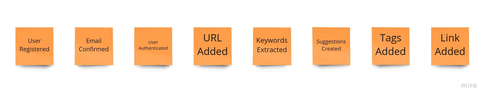

# Description

Applied steps in solving real world software development challenges.

## Task

Create an application allows an authenticated user to add URLs and assign tags to them.  
After logging in, a user can add links to their space.  
Each link must have at least one tag (i.e. news, but not HTML tag ​ ) associated with it.  
Multiple users can add the same link independently.Same user cannot add the same link multiple times.  
User can only manage (view, add tags, etc.) links added by him/her.  
When a user adds a link the system should parse the content of the provided link and do the content (text) analysis.  
While doing text analysis, the system should ignore stop words, short words and irrelevant content.  
Text analysis should go through the text and identify keywords that repeat more than two times.  
Keywords are all words mentioned in the html document with the remark that html tags are stripped (don’t confuse it with meta keywords).  
For example, if the system was parsing the sports page:  
`http://bbc.com/news/sport/1234/real-barsa-el-clasico`  
where a match between Barcelona and Real Madrid was being reviewed then words like ‘soccer’, ‘referee’, ‘Barcelona’, ‘Real Madrid’ would be the keywords that repeat more than twice in the text.  
The system should suggest a maximum of 10 and a minimum of 1 top keywords sorted from those with the highest number of occurrences to the lowest.  
These keywords would then be suggestions for new tags for this specific URL.

Features:

+ Sign up (email, display name, password).
+ Sign in using email and password.
+ Email verification (additional option)

+ Add links with at least one Tag.
  The API should handle the following links, as they are the same:  
    `www.example.com/?foo=bar&hello=world`  
    `http://www.example.com/?foo=bar&hello=world`  
    `http://www.example.com/?hello=world&foo=bar`  

+ Get all links for the authenticated user.
+ Search links for the authenticated user by tags.

+ Get suggested tags for existing link by other users sorted by number of occurrences.
+ Get suggested tags for existing link, based on the link content (text) analysis (​ mandatory​ )
+ Add tags to a link.

## Solution

### Event Storming

Event Storming is a rapid design technique that is meant to engage both Domain Experts and
developers in a fast-paced learning process. It is focused on the business and business process rather
than on nouns and data.  

1st phase:

