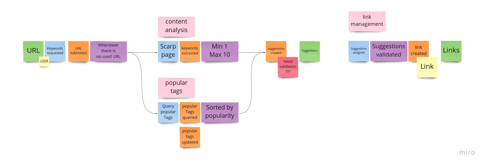

# Description

Applied steps in solving real world software development challenges.

## Task

Create an application where, after logging in, a user can add links to their space.  
Each link must have at least one tag associated with it.  
Multiple users can add the same link independently.  
Same user cannot add the same link multiple times.  
User can only manage (view, add tags, etc.) links added by him/her.  
When a user adds a link the system should parse the content of the provided link and do the content analysis.  
While doing text analysis, the system should ignore stop words, short words and irrelevant content.  
Text analysis should go through the text and identify keywords that repeat more than two times.  
Keywords are all words mentioned in the html document with the remark that html tags are stripped.  
For example, if the system was parsing the sports page:  
`http://bbc.com/news/sport/1234/real-barsa-el-clasico`  
where a match between Barcelona and Real Madrid was being reviewed then words like ‘soccer’, ‘referee’, ‘Barcelona’, ‘Real Madrid’ would be the keywords that repeat more than twice in the text.  
The system should suggest a maximum of 10 and a minimum of 1 top keywords sorted from those with the highest number of occurrences to the lowest.  
These keywords would then be suggestions for new tags for this specific URL.  
The API should handle the following links, as they are the same:  
    `www.example.com/?foo=bar&hello=world`  
    `http://www.example.com/?foo=bar&hello=world`  
    `http://www.example.com/?hello=world&foo=bar`  

Features:

+ Get all links for the authenticated user.
+ Search links for the authenticated user by tags.
+ Get suggested tags for existing link by other users sorted by number of occurrences.
+ Get suggested tags for existing link, based on the link content analysis. - mandatory
+ Add tags to a link.

## Solution

### Event Storming

The following is result of Event Storming Session:
  

### Road-map

For road-map, tho popular tags feture can be implemented in later releases.For this feature Kafka can be used.  

### Implementation

Initial release is implemented as monolith with possibility to extent to two microservices. Package structure is
organized in this way. 
Other dependencies of this project are:

1. MongoDB - for storing Links
2. Redis - for validation
3. Keycloak - authentication server
4. Postgres - user database

### Running 

There is docker-compose file for all dependencies and needs to be up and running before running scraper application.  
For running integration test, current implementation needs manual user registration and tests update with userId.  
To build scraper application run:  

 `mvn clean install`  
  
  and  
 
 `java -jar ./target/*.jar`
 
 in /monolith directory.

Api documentation page is located at:
`http://localhost:8080/v3/api-docs`

Following are screenshots of link creation process:  

 

And result as JSON which is then used as body to persist link:  

 

To gett all user links, there is Pagebale interface in the LinksController:  

 
